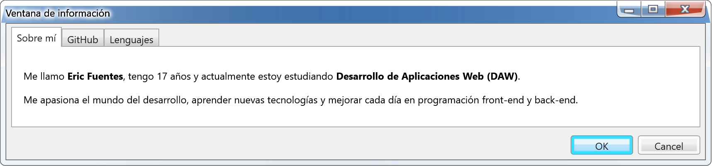

## 📚 Tecnologías y Herramientas

- **Lenguajes**: HTML, CSS, JS (nivel básico) y C++ (nivel básico)
- **Bases de Datos**: MySQL
- **Herramientas**: Git, GitHub, VSCode

---

## ✨ Un poco sobre mí

- 🤓 **Autodidacta**: Siempre estoy en busca de algo nuevo que aprender para seguir mejorando.
- 🎯 **Enfocado**: Me esfuerzo por alcanzar mis metas, paso a paso.

---

## 💻 Estadísticas

---

     
    HTML

